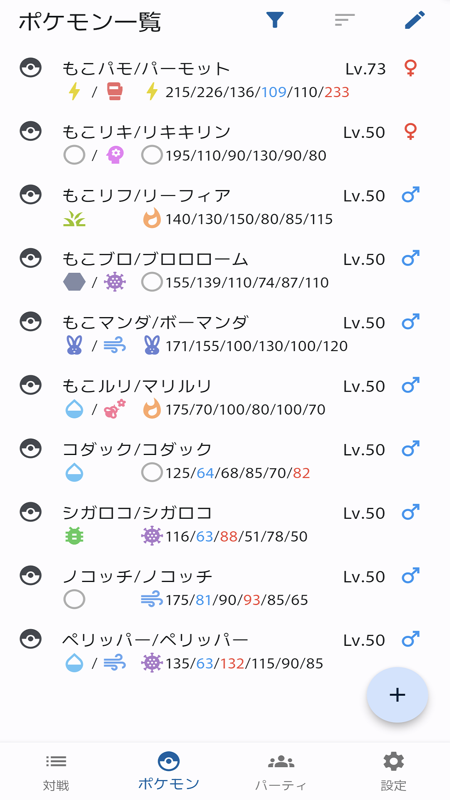
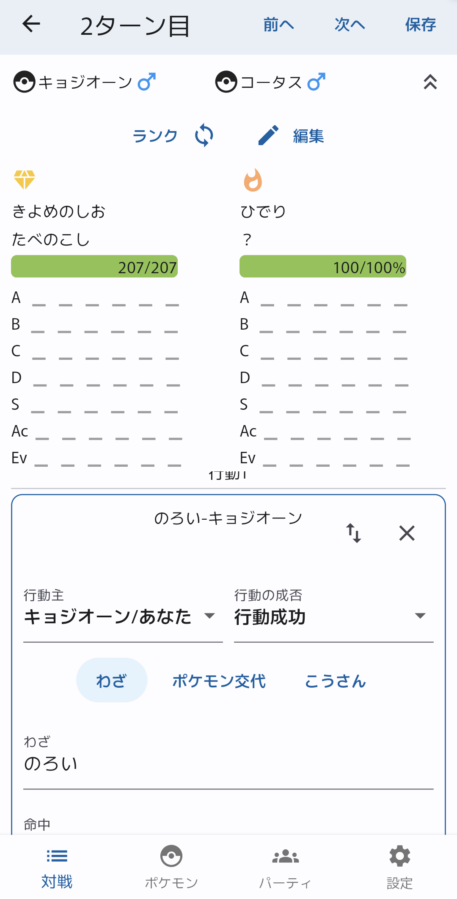
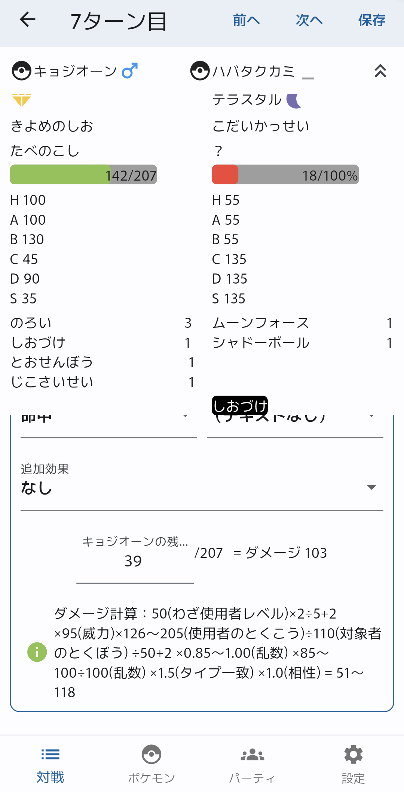

# ポケレコ(PokeReco)

育成したポケモン・パーティ・対戦を記録するAndroid向けアプリです(iOSは未定)。

ダウンロード↓

  

## 特徴

## 環境構築

### Windows(for Android)

### Mac OS(for iOS)
* 公式：https://docs.flutter.dev/get-started/install/macos/mobile-ios
* 日本語記事：https://zenn.dev/kboy/books/ca6a9c93fd23f3/viewer/5232dc

## 注意事項

### Flutterのルートディレクトリ
Flutterのルートディレクトリはpoke_reco/です。
Flutterのコマンドを実行するとき(`flutter pub get`など)はpoke_recoに移動してから行ってください。

### 広告ユニット表示部の削除
TODO

### 一部パッケージのコード修正が必要

上下矢印付きの数値入力ボックスでキーボードを使って文字を消すと例外が出るバグがあるので、下記の修正を施す（現在公式のアップデート待ち状態）
https://github.com/rmsmani/number_inc_dec/commit/74ce164a25f0ab7c3b162b432f64210be88b10d9
