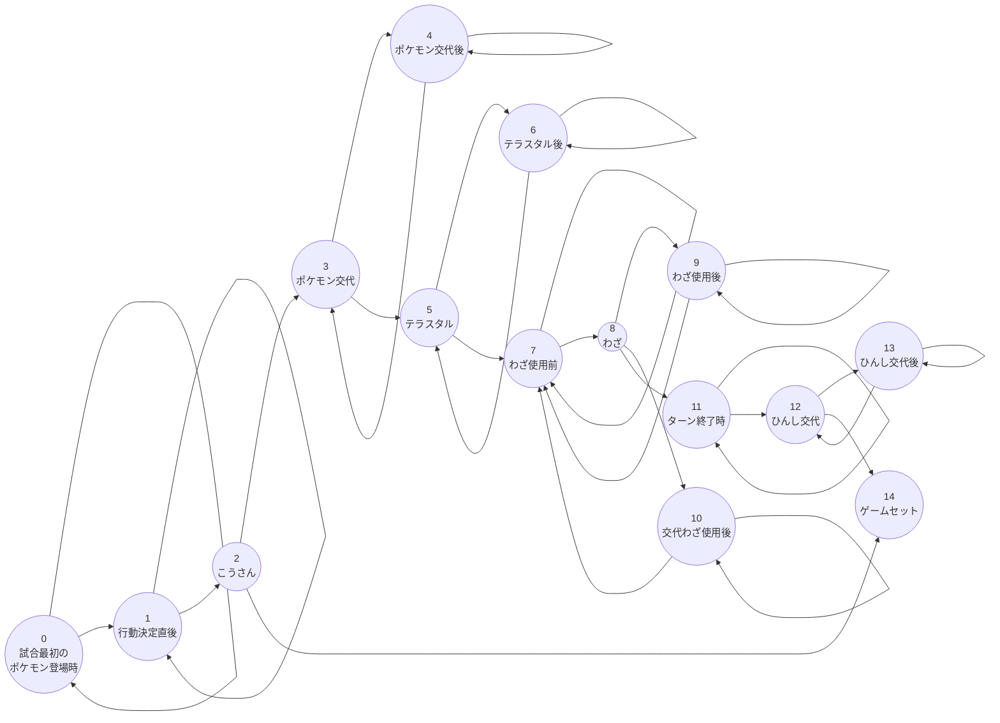

## １ターン内の処理(phase)遷移図

turn.dart ファイルの PhaseList クラス内 adjust 関数で行う処理に該当。

TODO: 図の可読性向上や説明の追加

```mermaid
flowchart LR

A(("0\n試合最初の\nポケモン登場時"))
B(("1\n行動決定直後"))
C(("2\nこうさん"))
D(("3\nポケモン交代"))
E(("4\nポケモン交代後"))
F(("5\nテラスタル"))
G(("6\nテラスタル後"))
H(("7\nわざ使用前"))
I(("8\nわざ"))
J(("9\nわざ使用後"))
K(("10\n交代わざ使用後"))
L(("11\nターン終了時"))
M(("12\nひんし交代"))
N(("13\nひんし交代後"))
O(("14\nゲームセット"))

A-->A & B

B-->B & C

C-->D & O

D-->E & F

E-->E & D

F-->G & H

G-->G & F

H-->H & I

I-->J & K & L

J-->J & H

K-->K & H

L-->L & M

M-->N

N-->N & M
M-->O

```
